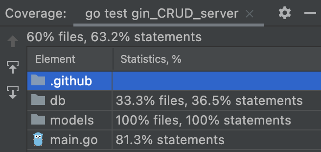

# GoGin - CRUD Users Server


## Gin Golang
[Gin](https://github.com/gin-gonic/gin) is a web framework written in Go (Golang). It features a martini-like API with performance that is up to 40 times faster thanks to httprouter.

### Advantages
1. Simple code - can save the developer a lot of time in large projects.
2. High performance.
3. Error management.
4. Easy JSON authentication.
5. Gin has a mode test.

### Disadvantages
1. Not flexible in development.
2. Can add more complexity to your project and slow down the development time, the infrastructure now depends on the package that other people maintain.

### Alternative Solutions
1. [net/http:](https://github.com/golang/go) it's easier to use and can handle more cases.
2. [fasthttp:](https://github.com/valyala/fasthttp) was designed for some high-performance edge cases.
3. [fiber:](https://github.com/gofiber/fiber) built on top of the fasthttp HTTP engine for Go, which is the fastest HTTP engine for Go.
4. [echo:](https://github.com/labstack/echo) supports HTTP/2 for faster performance and an overall better user experience and has automatic TLS certificates.


## Details of the application
Backend Golang application that has the following routes (using gin):
* ***PUT    /user  -*** add a new user, you need to add a JSON including email, username, and password in the request body.
* ***GET    /user  -*** to get an existing user, you need to add an email in the request form-data.
* ***POST   /user  -*** to update a username and password for an existing user, you need to add a JSON including email, username, and password in the request body.
* ***DELETE /user  -*** to delete an existing user, you need to add an email in the request form-data.
* ***GET    /users -*** returns a JSON array with the list of users.


## Requirements
* [Golang:](https://go.dev/doc/install) version >= 1.18
* [docker:](https://docs.docker.com/engine/install/) version >= 20.10.17
* [docker compose:](https://docs.docker.com/compose/install/) version >= 2.7.0


## Running Step
```
$ docker compose up --build
```

### For example
```
[baria@~ gin-crud-users-server]$ docker compose up --build
[+] Building 40.2s (17/17) FINISHED
 => [internal] load build definition from Dockerfile                                                                                            0.0s
 => => transferring dockerfile: 694B                                                                                                            0.0s
 => [internal] load .dockerignore                                                                                                               0.0s
 => => transferring context: 2B                                                                                                                 0.0s
 => [internal] load metadata for docker.io/library/golang:1.18                                                                                  0.0s
 => CACHED [stage-0 1/9] FROM docker.io/library/golang:1.18                                                                                     0.0s
 => [internal] load build context                                                                                                               0.1s
 => => transferring context: 396.05kB                                                                                                           0.1s
 => [stage-0 2/9] ADD go.mod /go/src/gin_CRUD_server/go.mod                                                                                     0.1s
 => [stage-0 3/9] ADD go.sum /go/src/gin_CRUD_server/go.sum                                                                                     0.1s
 => [stage-0 4/9] WORKDIR /go/src/gin_CRUD_server                                                                                               0.1s
 => [stage-0 5/9] RUN go mod download                                                                                                          14.4s
 => [stage-0 6/9] ADD . /go/src/gin_CRUD_server/                                                                                                0.2s
 => [stage-0 7/9] WORKDIR /go/src/gin_CRUD_server/                                                                                              0.1s
 => [stage-0 8/9] RUN apt-get update -y && apt-get install -y ca-certificates                                                                   9.6s
 => [stage-0 9/9] RUN go build -o server .                                                                                                     14.8s
 => CACHED [stage-1 1/3] COPY ssl.key /etc/ssl/certs/                                                                                           0.0s
 => CACHED [stage-1 2/3] COPY ssl.crt /etc/ssl/certs/                                                                                           0.0s
 => [stage-1 3/3] COPY --from=0 /go/src/gin_CRUD_server/server .                                                                                0.3s
 => exporting to image                                                                                                                          0.2s
 => => exporting layers                                                                                                                         0.2s
 => => writing image sha256:2e897fb304c45f26b675ed4aba01837abf458bb1465c2b477c10a5b44ab4f0d9                                                    0.0s
 => => naming to docker.io/library/gin-crud-users-server_server                                                                                 0.0s

Use 'docker scan' to run Snyk tests against images to find vulnerabilities and learn how to fix them
[+] Running 4/4
 ⠿ Network gin-crud-users-server_default       Created                                                                                          0.5s
 ⠿ Volume "gin-crud-users-server_data"         Created                                                                                          0.0s
 ⠿ Container gin-crud-users-server-database-1  Created                                                                                          0.1s
 ⠿ Container gin-crud-users-server-server-1    Created                                                                                          0.1s
Attaching to gin-crud-users-server-database-1, gin-crud-users-server-server-1
gin-crud-users-server-database-1  | The files belonging to this database system will be owned by user "postgres".
gin-crud-users-server-database-1  | This user must also own the server process.
gin-crud-users-server-database-1  |
gin-crud-users-server-database-1  | The database cluster will be initialized with locale "en_US.utf8".
gin-crud-users-server-database-1  | The default database encoding has accordingly been set to "UTF8".
gin-crud-users-server-database-1  | The default text search configuration will be set to "english".
gin-crud-users-server-database-1  |
gin-crud-users-server-database-1  | Data page checksums are disabled.
gin-crud-users-server-database-1  |
gin-crud-users-server-database-1  | fixing permissions on existing directory /var/lib/postgresql/data ... ok
gin-crud-users-server-database-1  | creating subdirectories ... ok
gin-crud-users-server-database-1  | selecting dynamic shared memory implementation ... posix
gin-crud-users-server-database-1  | selecting default max_connections ... 100
gin-crud-users-server-database-1  | selecting default shared_buffers ... 128MB
gin-crud-users-server-database-1  | selecting default time zone ... Etc/UTC
gin-crud-users-server-database-1  | creating configuration files ... ok
gin-crud-users-server-database-1  | running bootstrap script ... ok
gin-crud-users-server-database-1  | performing post-bootstrap initialization ... ok
gin-crud-users-server-database-1  | syncing data to disk ... initdb: warning: enabling "trust" authentication for local connections
gin-crud-users-server-database-1  | You can change this by editing pg_hba.conf or using the option -A, or
gin-crud-users-server-database-1  | --auth-local and --auth-host, the next time you run initdb.
gin-crud-users-server-database-1  | ok
gin-crud-users-server-database-1  |
gin-crud-users-server-database-1  |
gin-crud-users-server-database-1  | Success. You can now start the database server using:
gin-crud-users-server-database-1  |
gin-crud-users-server-database-1  |     pg_ctl -D /var/lib/postgresql/data -l logfile start
gin-crud-users-server-database-1  |
gin-crud-users-server-database-1  | waiting for server to start....2022-07-23 13:27:20.757 UTC [48] LOG:  starting PostgreSQL 14.4 (Debian 14.4-1.pgdg110+1) on x86_64-pc-linux-gnu, compiled by gcc (Debian 10.2.1-6) 10.2.1 20210110, 64-bit
gin-crud-users-server-database-1  | 2022-07-23 13:27:20.759 UTC [48] LOG:  listening on Unix socket "/var/run/postgresql/.s.PGSQL.5432"
gin-crud-users-server-database-1  | 2022-07-23 13:27:20.768 UTC [49] LOG:  database system was shut down at 2022-07-23 13:27:20 UTC
gin-crud-users-server-database-1  | 2022-07-23 13:27:20.774 UTC [48] LOG:  database system is ready to accept connections
gin-crud-users-server-database-1  |  done
gin-crud-users-server-database-1  | server started
gin-crud-users-server-database-1  | CREATE DATABASE
gin-crud-users-server-database-1  |
gin-crud-users-server-database-1  |
gin-crud-users-server-database-1  | /usr/local/bin/docker-entrypoint.sh: running /docker-entrypoint-initdb.d/create_tables.sql
gin-crud-users-server-database-1  | CREATE TABLE
gin-crud-users-server-database-1  |
gin-crud-users-server-database-1  |
gin-crud-users-server-database-1  | waiting for server to shut down....2022-07-23 13:27:21.281 UTC [48] LOG:  received fast shutdown request
gin-crud-users-server-database-1  | 2022-07-23 13:27:21.284 UTC [48] LOG:  aborting any active transactions
gin-crud-users-server-database-1  | 2022-07-23 13:27:21.285 UTC [48] LOG:  background worker "logical replication launcher" (PID 55) exited with exit code 1
gin-crud-users-server-database-1  | 2022-07-23 13:27:21.288 UTC [50] LOG:  shutting down
gin-crud-users-server-database-1  | 2022-07-23 13:27:21.350 UTC [48] LOG:  database system is shut down
gin-crud-users-server-database-1  |  done
gin-crud-users-server-database-1  | server stopped
gin-crud-users-server-database-1  |
gin-crud-users-server-database-1  | PostgreSQL init process complete; ready for start up.
gin-crud-users-server-database-1  |
gin-crud-users-server-database-1  | 2022-07-23 13:27:21.414 UTC [1] LOG:  starting PostgreSQL 14.4 (Debian 14.4-1.pgdg110+1) on x86_64-pc-linux-gnu, compiled by gcc (Debian 10.2.1-6) 10.2.1 20210110, 64-bit
gin-crud-users-server-database-1  | 2022-07-23 13:27:21.415 UTC [1] LOG:  listening on IPv4 address "0.0.0.0", port 5432
gin-crud-users-server-database-1  | 2022-07-23 13:27:21.415 UTC [1] LOG:  listening on IPv6 address "::", port 5432
gin-crud-users-server-database-1  | 2022-07-23 13:27:21.419 UTC [1] LOG:  listening on Unix socket "/var/run/postgresql/.s.PGSQL.5432"
gin-crud-users-server-database-1  | 2022-07-23 13:27:21.425 UTC [64] LOG:  database system was shut down at 2022-07-23 13:27:21 UTC
gin-crud-users-server-database-1  | 2022-07-23 13:27:21.432 UTC [1] LOG:  database system is ready to accept connections
gin-crud-users-server-server-1    | [GIN-debug] [WARNING] Creating an Engine instance with the Logger and Recovery middleware already attached.
gin-crud-users-server-server-1    |
gin-crud-users-server-server-1    | [GIN-debug] [WARNING] Running in "debug" mode. Switch to "release" mode in production.
gin-crud-users-server-server-1    |  - using env:	export GIN_MODE=release
gin-crud-users-server-server-1    |  - using code:	gin.SetMode(gin.ReleaseMode)
gin-crud-users-server-server-1    |
gin-crud-users-server-server-1    | [GIN-debug] PUT    /user                     --> main.AddUserHandler (3 handlers)
gin-crud-users-server-server-1    | [GIN-debug] GET    /user                     --> main.GetUserHandler (3 handlers)
gin-crud-users-server-server-1    | [GIN-debug] POST   /user                     --> main.UpdateUserHandler (3 handlers)
gin-crud-users-server-server-1    | [GIN-debug] DELETE /user                     --> main.DeleteUserHandler (3 handlers)
gin-crud-users-server-server-1    | [GIN-debug] GET    /users                    --> main.ListUsersHandler (3 handlers)
gin-crud-users-server-server-1    | [GIN-debug] Listening and serving HTTP on listener what's bind with address@[::]:3000
gin-crud-users-server-server-1    | [GIN-debug] [WARNING] You trusted all proxies, this is NOT safe. We recommend you to set a value.
gin-crud-users-server-server-1    | Please check https://pkg.go.dev/github.com/gin-gonic/gin#readme-don-t-trust-all-proxies for details.
gin-crud-users-server-server-1    | [GIN] 2022/07/23 - 13:31:42 | 200 |   17.538962ms |      172.31.0.1 | PUT      "/user"
gin-crud-users-server-server-1    | [GIN] 2022/07/23 - 13:31:56 | 200 |    2.898708ms |      172.31.0.1 | GET      "/users"
gin-crud-users-server-server-1    | [GIN] 2022/07/23 - 13:32:20 | 200 |   17.781365ms |      172.31.0.1 | PUT      "/user"
gin-crud-users-server-server-1    | [GIN] 2022/07/23 - 13:32:44 | 400 |      32.787µs |      172.31.0.1 | DELETE   "/user"
gin-crud-users-server-server-1    | [GIN] 2022/07/23 - 13:33:17 | 200 |   25.724964ms |      172.31.0.1 | POST     "/user"
gin-crud-users-server-server-1    | [GIN] 2022/07/23 - 13:33:20 | 200 |    1.645589ms |      172.31.0.1 | GET      "/users"
```

### Examples of curl commands
* For testing PUT /user
    ```
    curl -X PUT https://localhost:3000/user \
         --header "Content-Type: application/json" \
         --data '{"email": "<email>","name": "<username>","password": "<password>"}'
    ```
* For testing GET /user
    ```
    curl -X GET https://localhost:3000/user --form 'email=<email>'
    ```
* For testing POST /user
    ```
    curl -X POST https://localhost:3000/user \
         --header "Content-Type: application/json" \
         --data '{"email": "<email>","name": "<username>","password": "<password>"}'
    ```
* For testing DELETE /user
    ```
    curl -X DELETE https://localhost:3000/user --form 'email=<email>'
    ```
* For testing GET /users
    ```
    curl -X GET https://localhost:3000/users
    ```


## Unit Tests Output
```
=== RUN   Test_createTLSCert
=== RUN   Test_createTLSCert/Failed_to_create_due_to_empty_certFile
Cannot load TLS certificate from certFile="", keyFile="ssl.key": open : no such file or directory
=== RUN   Test_createTLSCert/Failed_to_create_due_to_empty_keyFile
Cannot load TLS certificate from certFile="ssl.crt", keyFile="": open : no such file or directory
=== RUN   Test_createTLSCert/Creates_TLS_cert_successfully
=== RUN   Test_createTLSCert/Failed_to_create_due_to_empty_port
--- PASS: Test_createTLSCert (0.00s)
    --- PASS: Test_createTLSCert/Failed_to_create_due_to_empty_certFile (0.00s)
    --- PASS: Test_createTLSCert/Failed_to_create_due_to_empty_keyFile (0.00s)
    --- PASS: Test_createTLSCert/Creates_TLS_cert_successfully (0.00s)
    --- PASS: Test_createTLSCert/Failed_to_create_due_to_empty_port (0.00s)
    
=== RUN   TestListUsersHandler
=== RUN   TestListUsersHandler/Failed_to_get_users_list_due_to_incorrect_URL
The users map is empty
=== RUN   TestListUsersHandler/Gets_fail_due_to_empty_users_map
The users map is empty
=== RUN   TestListUsersHandler/Gets_users_list_successfully_(if_there_are_users_in_the_folder)
Current users map:
* Email: bari@gmail.com, Username: bari, Password: 1234
--- PASS: TestListUsersHandler (0.00s)
    --- PASS: TestListUsersHandler/Failed_to_get_users_list_due_to_incorrect_URL (0.00s)
    --- PASS: TestListUsersHandler/Gets_fail_due_to_empty_users_map (0.00s)
    --- PASS: TestListUsersHandler/Gets_users_list_successfully_(if_there_are_users_in_the_folder) (0.00s)
    
=== RUN   TestAddUserHandler
=== RUN   TestAddUserHandler/Adds_a_new_user_successfully
Current users map:
* Email: bari@gmail.com, Username: bari, Password: 1234
## bari@gmail.com added successfully:
Current users map:
* Email: bari@gmail.com, Username: bari, Password: 1234
=== RUN   TestAddUserHandler/Adds_fail_due_to_incorrect_user_(nil)
Current users map:
* Email: bari@gmail.com, Username: bari, Password: 1234
=== RUN   TestAddUserHandler/Adds_fail_due_to_incorrect_URL
Current users map:
* Email: bari@gmail.com, Username: bari, Password: 1234
=== RUN   TestAddUserHandler/Adds_fail_due_to_incorrect_empty_user
Current users map:
* Email: bari@gmail.com, Username: bari, Password: 1234
=== RUN   TestAddUserHandler/Adds_fail_due_to_the_invalid_email
Current users map:
* Email: bari@gmail.com, Username: bari, Password: 1234
--- PASS: TestAddUserHandler (0.00s)
    --- PASS: TestAddUserHandler/Adds_a_new_user_successfully (0.00s)
    --- PASS: TestAddUserHandler/Adds_fail_due_to_incorrect_user_(nil) (0.00s)
    --- PASS: TestAddUserHandler/Adds_fail_due_to_incorrect_URL (0.00s)
    --- PASS: TestAddUserHandler/Adds_fail_due_to_incorrect_empty_user (0.00s)
    --- PASS: TestAddUserHandler/Adds_fail_due_to_the_invalid_email (0.00s)
    
=== RUN   TestGetUserHandler
=== RUN   TestGetUserHandler/Gets_fail_due_to_empty_email
Current users map:
* Email: bari@gmail.com, Username: bari, Password: 1234
=== RUN   TestGetUserHandler/Gets_fail_due_to_the_invalid_email
Current users map:
* Email: bari@gmail.com, Username: bari, Password: 1234
=== RUN   TestGetUserHandler/Gets_an_existing_user_successfully
Current users map:
* Email: bari@gmail.com, Username: bari, Password: 1234
## bari@gmail.com gets successfully:
Current users map:
* Email: bari@gmail.com, Username: bari, Password: 1234
=== RUN   TestGetUserHandler/Gets_fail_due_to_the_user_doesn't_exist
Current users map:
* Email: bari@gmail.com, Username: bari, Password: 1234
=== RUN   TestGetUserHandler/Gets_fail_due_to_incorrect_URL
Current users map:
* Email: bari@gmail.com, Username: bari, Password: 1234
--- PASS: TestGetUserHandler (0.00s)
    --- PASS: TestGetUserHandler/Gets_fail_due_to_empty_email (0.00s)
    --- PASS: TestGetUserHandler/Gets_fail_due_to_the_invalid_email (0.00s)
    --- PASS: TestGetUserHandler/Gets_an_existing_user_successfully (0.00s)
    --- PASS: TestGetUserHandler/Gets_fail_due_to_the_user_doesn't_exist (0.00s)
    --- PASS: TestGetUserHandler/Gets_fail_due_to_incorrect_URL (0.00s)
    
=== RUN   TestUpdateUserHandler
=== RUN   TestUpdateUserHandler/Updates_fail_due_to_incorrect_user_(nil)
Current users map:
* Email: bari@gmail.com, Username: bari, Password: 1234
=== RUN   TestUpdateUserHandler/Updates_fail_due_to_incorrect_URL
Current users map:
* Email: bari@gmail.com, Username: bari, Password: 1234
=== RUN   TestUpdateUserHandler/Updates_fail_due_to_incorrect_empty_user
Current users map:
* Email: bari@gmail.com, Username: bari, Password: 1234
=== RUN   TestUpdateUserHandler/Updates_an_existing_user_successfully
Current users map:
* Email: bari@gmail.com, Username: bari, Password: 1234
## bari@gmail.com updated successfully:
Current users map:
* Email: bari@gmail.com, Username: bari2, Password: 12345
=== RUN   TestUpdateUserHandler/Updates_fail_due_to_incorrect_email
Current users map:
* Email: bari@gmail.com, Username: bari2, Password: 12345
--- PASS: TestUpdateUserHandler (0.00s)
    --- PASS: TestUpdateUserHandler/Updates_fail_due_to_incorrect_user_(nil) (0.00s)
    --- PASS: TestUpdateUserHandler/Updates_fail_due_to_incorrect_URL (0.00s)
    --- PASS: TestUpdateUserHandler/Updates_fail_due_to_incorrect_empty_user (0.00s)
    --- PASS: TestUpdateUserHandler/Updates_an_existing_user_successfully (0.00s)
    --- PASS: TestUpdateUserHandler/Updates_fail_due_to_incorrect_email (0.00s)
    
=== RUN   TestDeleteUserHandler
=== RUN   TestDeleteUserHandler/Deletes_fail_due_to_empty_email
Current users map:
* Email: bari@gmail.com, Username: bari, Password: 1234
=== RUN   TestDeleteUserHandler/Deletes_user_successfully
Current users map:
* Email: bari@gmail.com, Username: bari, Password: 1234
## bari@gmail.com deleted successfully:
The users map is empty
=== RUN   TestDeleteUserHandler/Deletes_fail_due_to_the_invalid_email
The users map is empty
=== RUN   TestDeleteUserHandler/Deletes_fail_due_to_incorrect_URL
The users map is empty
=== RUN   TestDeleteUserHandler/Deletes_fail_due_to_the_user_doesn't_exist
The users map is empty
--- PASS: TestDeleteUserHandler (0.00s)
    --- PASS: TestDeleteUserHandler/Deletes_fail_due_to_empty_email (0.00s)
    --- PASS: TestDeleteUserHandler/Deletes_user_successfully (0.00s)
    --- PASS: TestDeleteUserHandler/Deletes_fail_due_to_the_invalid_email (0.00s)
    --- PASS: TestDeleteUserHandler/Deletes_fail_due_to_incorrect_URL (0.00s)
    --- PASS: TestDeleteUserHandler/Deletes_fail_due_to_the_user_doesn't_exist (0.00s)
    
=== RUN   Test_getStatusAndMsgErr
=== RUN   Test_getStatusAndMsgErr/Gets_status_code_404
=== RUN   Test_getStatusAndMsgErr/Gets_status_code_500
--- PASS: Test_getStatusAndMsgErr (0.00s)
    --- PASS: Test_getStatusAndMsgErr/Gets_status_code_404 (0.00s)
    --- PASS: Test_getStatusAndMsgErr/Gets_status_code_500 (0.00s)
    
=== RUN   Test_setupRouter
--- PASS: Test_setupRouter (0.00s)
PASS

coverage: 63.2% of statements in ./...
```

<p align="center">
    
</p>
